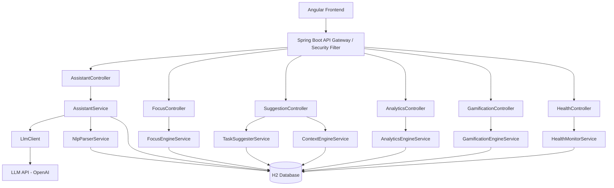

# Design Document: Smart Workday Assistant

## Overview

The Smart Workday Assistant extends the existing Spring Boot + Angular Workday Helper into an AI-powered productivity platform. Eight capabilities are added on top of the existing Task, Reminder, and User models, all secured behind the existing JWT authentication layer.

The system integrates an external LLM API (OpenAI-compatible) for chat and NLP parsing. All other intelligence (scoring, scheduling, gamification) is computed server-side in Java without external dependencies. The frontend Angular app gains new routes and components for each capability.

Key design decisions:
- LLM calls are isolated in a single `LlmClient` wrapper so the API key never reaches the client and the provider can be swapped.
- All new entities extend the existing user-ownership pattern (`@ManyToOne User`).
- Server-Sent Events (SSE) are used for real-time break and achievement notifications to avoid WebSocket complexity.
- H2 is retained for development; the schema is designed to be portable to PostgreSQL for production.

---

## Architecture



### Request Flow

1. Angular sends JWT-authenticated HTTP requests to Spring Boot controllers.
2. `JwtAuthFilter` validates the token and populates `SecurityContext`.
3. Controllers delegate to services; services read/write via JPA repositories.
4. `LlmClient` makes outbound HTTPS calls to the LLM API using a configured API key stored in `application.properties` (never returned to the client).
5. Break and achievement notifications are pushed to the frontend via SSE on `/api/notifications/stream`.

---

## Components and Interfaces

### Backend Controllers (new)

| Controller | Base Path | Responsibility |
|---|---|---|
| `AssistantController` | `/api/assistant` | Chat send, history retrieval |
| `NlpController` | `/api/nlp` | Natural-language task parsing |
| `SuggestionController` | `/api/suggestions` | Daily task suggestions, context-aware suggestions |
| `FocusController` | `/api/focus` | Start/end sessions, daily summary |
| `AnalyticsController` | `/api/analytics` | Daily/weekly scores, peak window |
| `GamificationController` | `/api/gamification` | Profile, points, streaks, achievements |
| `HealthController` | `/api/health` | Reminder dismissal, health events |
| `NotificationController` | `/api/notifications` | SSE stream endpoint |

### Backend Services (new)

**AssistantService**
```
sendMessage(user, text) -> ChatMessage          // calls LlmClient, persists both turns
getHistory(user) -> List<ChatMessage>           // last 50 messages, chronological
```

**NlpParserService**
```
parse(text, userLocalDate) -> Task              // deterministic, idempotent
```

**TaskSuggesterService**
```
getDailySuggestions(user, localTime) -> List<TaskSuggestion>
```

**FocusEngineService**
```
startSession(user, taskId, durationMinutes) -> FocusSession
endSession(user, sessionId) -> FocusSession
getDailySummary(user, date) -> FocusSummary
getActiveSession(user) -> Optional<FocusSession>
```

**AnalyticsEngineService**
```
getDailyAnalytics(user, date) -> DailyAnalytics
getWeeklyAnalytics(user) -> WeeklyAnalytics
getPeakWindow(user) -> Optional<TimeWindow>
```

**GamificationEngineService**
```
onTaskCompleted(user) -> void
onFocusSessionCompleted(user, durationMinutes) -> void
onDailyScoreRecorded(user, score) -> void
getProfile(user) -> GamificationProfile
```

**HealthMonitorService**
```
recordActivity(user) -> void
dismissReminder(user, type) -> void
getHealthEvents(user, date) -> List<HealthEvent>
```

**ContextEngineService**
```
getSuggestions(user, localTime) -> List<ContextSuggestion>
```

**LlmClient**
```
chat(systemPrompt, messages) -> String          // throws LlmException on error/timeout
```

### Frontend Components (new Angular)

| Component | Route | Purpose |
|---|---|---|
| `ChatComponent` | `/chat` | Chat UI with message history |
| `FocusComponent` | `/focus` | Start/stop session, timer display |
| `SuggestionsComponent` | `/suggestions` | Daily + context-aware task list |
| `AnalyticsDashboardComponent` | `/analytics` | Score charts, peak window, focus time |
| `GamificationComponent` | `/gamification` | Points, streak, achievements |
| `NotificationService` | (shared) | SSE subscription, toast display |

---

## Data Models

### New Entities

**ChatMessage**
```java
@Entity @Table(name = "chat_messages")
Long id
String role          // "user" | "assistant"
@Column(length = 2000) String content
LocalDateTime createdAt
@ManyToOne User user
```

**FocusSession**
```java
@Entity @Table(name = "focus_sessions")
Long id
LocalDateTime startTime
LocalDateTime endTime        // null while active
int targetDurationMinutes    // default 25
int actualDurationMinutes    // computed on end
boolean completed
@ManyToOne Task task
@ManyToOne User user
```

**TaskSuggestion** (transient DTO, not persisted)
```java
Long taskId
String title
String priority
LocalTime suggestedStartTime
LocalTime suggestedEndTime
double score
String rationale
```

**DailyAnalytics** (transient DTO)
```java
LocalDate date
int productivityScore        // 0-100
int focusMinutes
int distractionMinutes
double healthAdherenceRate
double completionRate
```

**GamificationProfile**
```java
@Entity @Table(name = "gamification_profiles")
Long id
int totalPoints
int currentStreak
int longestStreak
LocalDate lastStreakDate
@OneToMany List<Achievement> achievements
@OneToOne User user
```

**Achievement**
```java
@Entity @Table(name = "achievements")
Long id
String name              // "5-Day Streak", "10-Day Streak", "30-Day Streak"
String description
LocalDateTime unlockedAt
@ManyToOne GamificationProfile profile
```

**HealthEvent**
```java
@Entity @Table(name = "health_events")
Long id
String type              // "BREAK_90MIN" | "ACTIVITY_60MIN"
LocalDateTime emittedAt
boolean dismissed
LocalDateTime dismissedAt
@ManyToOne User user
```

### Existing Model Extensions

`Task` gains one optional field:
```java
int estimatedDurationMinutes   // default 30, used by TaskSuggester
```

`User` gains no structural changes; all new data is in separate entities.

### Repository Interfaces (new)

```
ChatMessageRepository    : findTop50ByUserOrderByCreatedAtAsc(user)
FocusSessionRepository   : findByUserAndEndTimeIsNull(user), findByUserAndStartTimeBetween(user, start, end)
GamificationProfileRepository : findByUser(user)
HealthEventRepository    : findByUserAndEmittedAtBetween(user, start, end)
AchievementRepository    : findByProfile(profile)
```

---

## Correctness Properties

*A property is a characteristic or behavior that should hold true across all valid executions of a system — essentially, a formal statement about what the system should do. Properties serve as the bridge between human-readable specifications and machine-verifiable correctness guarantees.*

### Property 1: Chat message persistence round-trip

*For any* valid user message sent to the assistant, both the user turn and the assistant turn should appear in the persisted chat history after the call completes.

**Validates: Requirements 1.2**

### Property 2: Chat history ordering and limit

*For any* user with N stored chat messages, requesting history should return min(N, 50) messages in strictly ascending `createdAt` order.

**Validates: Requirements 1.3**

### Property 3: LLM error does not persist messages

*For any* message where the LlmClient throws an exception, no ChatMessage records should be created for that exchange.

**Validates: Requirements 1.4**

### Property 4: Oversized message rejected

*For any* message string whose length exceeds 2000 characters, the chat endpoint should return HTTP 400 and no ChatMessage should be persisted.

**Validates: Requirements 1.5**

### Property 5: Unauthenticated requests rejected

*For any* request to a chat, focus, analytics, gamification, or suggestion endpoint that lacks a valid JWT, the response should be HTTP 401.

**Validates: Requirements 1.6**

### Property 6: API key absent from response

*For any* response body returned by any controller, the configured LLM API key string should not appear in the serialized JSON.

**Validates: Requirements 1.7**

### Property 7: NLP parse idempotence

*For any* natural-language input string, calling `NlpParserService.parse` twice with the same input and the same reference date should produce structurally equivalent Task objects.

**Validates: Requirements 2.4, 2.1**

### Property 8: NLP relative date resolution

*For any* input containing a relative date expression (e.g., "tomorrow", "next Monday"), the resolved `dueDate` in the returned Task should equal the correct absolute date computed from the provided reference `LocalDate`.

**Validates: Requirements 2.2**

### Property 9: NLP invalid input returns 422

*For any* input string from which no title can be extracted (e.g., purely whitespace or empty), the NLP endpoint should return HTTP 422.

**Validates: Requirements 2.3**

### Property 10: Parsed and manual tasks treated equally by suggester

*For any* Task created via NLP parsing and an equivalent Task created manually with identical fields, the composite score computed by `TaskSuggesterService` should be equal for both.

**Validates: Requirements 2.5**

### Property 11: Suggestions ranked by composite score

*For any* list of pending tasks, the suggestions returned by `TaskSuggesterService` should be ordered by descending composite score (except when the due-within-24h override applies).

**Validates: Requirements 3.1**

### Property 12: Time block assignment by priority

*For any* HIGH priority task in the suggestion list, its `suggestedStartTime` should fall between 08:00 and 12:00. For any LOW priority task, its `suggestedStartTime` should be at or after 14:00.

**Validates: Requirements 3.2**

### Property 13: Due-within-24h task ranks first

*For any* task list containing at least one task whose `dueDate` is within 24 hours of the current time, that task should appear at position 0 in the suggestions list.

**Validates: Requirements 3.4**

### Property 14: Each suggestion has a time block

*For any* TaskSuggestion returned by the suggester, both `suggestedStartTime` and `suggestedEndTime` should be non-null and `endTime` should be after `startTime`.

**Validates: Requirements 3.6**

### Property 15: Focus session start fields correct and persisted

*For any* valid start-session request with a given taskId and durationMinutes, the persisted FocusSession should have a non-null `startTime`, `endTime` of null, `targetDurationMinutes` equal to the requested value (or 25 if not specified), and the correct `task` association.

**Validates: Requirements 4.1, 4.7**

### Property 16: Focus session duration computation

*For any* completed FocusSession with a known `startTime` and `endTime`, `actualDurationMinutes` should equal `ChronoUnit.MINUTES.between(startTime, endTime)`.

**Validates: Requirements 4.2**

### Property 17: Duplicate session start rejected with 409

*For any* user who already has an active (non-ended) FocusSession, a new start-session request should return HTTP 409 containing the active session ID.

**Validates: Requirements 4.5**

### Property 18: Cross-user session end rejected with 403

*For any* FocusSession owned by user A, an end-session request authenticated as user B should return HTTP 403.

**Validates: Requirements 4.6**

### Property 19: Daily focus summary totals correct

*For any* set of completed FocusSessions on a given calendar day, the `totalDeepWorkMinutes` in the daily summary should equal the sum of all `actualDurationMinutes` for those sessions.

**Validates: Requirements 4.4**

### Property 20: Productivity score formula

*For any* combination of `completionRate` (0–1), `focusMinutes` (0–240+), and `healthAdherenceRate` (0–1), the computed `productivityScore` should equal `round(completionRate * 40 + min(focusMinutes / 240.0, 1.0) * 40 + healthAdherenceRate * 20)` clamped to [0, 100].

**Validates: Requirements 5.1**

### Property 21: Weekly rolling average

*For any* sequence of 7 daily productivity scores, the `weeklyAverage` returned by the analytics engine should equal their arithmetic mean rounded to two decimal places.

**Validates: Requirements 5.2**

### Property 22: Peak window detection

*For any* dataset of FocusSessions spanning at least 5 days, the returned peak productivity window should be the 2-hour slot with the highest total focus minutes across all days, and no other 2-hour window should have a higher total.

**Validates: Requirements 5.3**

### Property 23: Distraction time equals logged-in minus focus

*For any* analytics period, `distractionMinutes` should equal `loggedInMinutes - focusMinutes` and should never be negative.

**Validates: Requirements 5.4**

### Property 24: Reminder emitted after activity threshold

*For any* FocusSession active for at least 90 consecutive minutes, a BREAK_90MIN HealthEvent should be emitted. For any user active outside a session for at least 60 minutes, an ACTIVITY_60MIN HealthEvent should be emitted.

**Validates: Requirements 6.1, 6.2**

### Property 25: Dismissed reminder suppressed for 15 minutes

*For any* reminder type dismissed by a user at time T, no further reminder of that same type should be emitted before T + 15 minutes.

**Validates: Requirements 6.3**

### Property 26: Unknown activity state emits no reminders

*For any* user whose activity state cannot be determined, the HealthMonitor should emit zero HealthEvents.

**Validates: Requirements 6.4**

### Property 27: Health events persisted on emit

*For any* reminder emitted by the HealthMonitor, a corresponding HealthEvent record should be retrievable from the repository for that user.

**Validates: Requirements 6.5**

### Property 28: Context suggestions max 5 with rationale

*For any* context-aware suggestion request, the returned list should contain at most 5 items and every item should have a non-null, non-empty `rationale` string.

**Validates: Requirements 7.1**

### Property 29: Peak hours ordering

*For any* request made during the user's detected peak productivity window, all HIGH priority tasks should appear before all LOW priority tasks in the suggestion list.

**Validates: Requirements 7.2**

### Property 30: Wrap-up suggestion after 16:00

*For any* context-aware suggestion request made at or after 16:00 local time, the response list should include at least one suggestion with a wrap-up rationale.

**Validates: Requirements 7.3**

### Property 31: Points accumulation for tasks and sessions

*For any* user starting with P points, completing N tasks and M qualifying focus sessions (>= 25 min each) should result in a total of P + 10*N + 20*M points.

**Validates: Requirements 8.1, 8.2**

### Property 32: Streak correctness — increment and reset

*For any* sequence of daily productivity scores, the streak counter after processing that sequence should equal the length of the longest suffix of consecutive days all scoring >= 60, and should be 0 if the most recent day scored below 60.

**Validates: Requirements 8.3, 8.5**

### Property 33: Achievement unlock at streak milestones

*For any* user whose streak reaches exactly 5, 10, or 30, the corresponding achievement ("5-Day Streak", "10-Day Streak", "30-Day Streak") should appear in their achievement list exactly once.

**Validates: Requirements 8.4**

### Property 34: Gamification profile completeness

*For any* gamification profile request, the response should contain non-null `totalPoints`, `currentStreak`, and `achievements` fields.

**Validates: Requirements 8.6**

---

## Error Handling

### LLM API Failures (Requirement 1.4)
- `LlmClient` wraps all outbound calls in a try-catch; on timeout or HTTP error it throws `LlmException`.
- `AssistantService` catches `LlmException`, returns a user-facing error message, and does not call the repository.
- A 10-second `RestTemplate` read timeout is configured on the LLM HTTP client bean.

### NLP Parse Failures (Requirement 2.3)
- `NlpParserService` returns an `Optional<Task>`; empty means no title could be extracted.
- `NlpController` maps empty result to HTTP 422 with a descriptive body.

### Focus Session Conflicts (Requirements 4.5, 4.6)
- `FocusEngineService.startSession` checks for an active session via `findByUserAndEndTimeIsNull`; throws `ConflictException` (→ 409) if one exists.
- `FocusEngineService.endSession` verifies `session.getUser().equals(user)`; throws `ForbiddenException` (→ 403) otherwise.

### Analytics Empty Data (Requirement 5.6)
- All analytics computations guard against empty collections by returning zero-valued DTOs rather than throwing.

### Health Monitor Unknown State (Requirement 6.4)
- `HealthMonitorService` treats a null or missing activity record as inactive and skips reminder emission.

### Global Exception Handling
- A `@RestControllerAdvice` maps:
  - `LlmException` → 503 with message
  - `ConflictException` → 409
  - `ForbiddenException` → 403
  - `EntityNotFoundException` → 404
  - `ConstraintViolationException` → 400
  - Unhandled exceptions → 500 (no stack trace in response)

---

## Testing Strategy

### Dual Testing Approach

Both unit tests and property-based tests are required. They are complementary:
- Unit tests cover specific examples, integration points, and edge cases.
- Property-based tests verify universal correctness across randomized inputs.

### Unit Tests

Focus on:
- Controller integration tests (MockMvc) for auth, status codes, and response shapes.
- Service-layer tests with mocked repositories for specific scenarios (e.g., LLM error path, 409 conflict).
- Edge cases: empty task list, zero focus minutes, new user with no history.
- `LlmClient` mock to avoid real API calls in tests.

### Property-Based Tests

Library: **jqwik** (Java property-based testing library, integrates with JUnit 5).

Add to `pom.xml`:
```xml
<dependency>
    <groupId>net.jqwik</groupId>
    <artifactId>jqwik</artifactId>
    <version>1.8.1</version>
    <scope>test</scope>
</dependency>
```

Configuration: minimum 100 tries per property (`@Property(tries = 100)`).

Each property test must be tagged with a comment referencing the design property:
```
// Feature: smart-workday-assistant, Property N: <property_text>
```

**Property test mapping** (one test per property):

| Test Class | Property | Design Property |
|---|---|---|
| `AssistantServicePropertyTest` | Chat persistence round-trip | P1 |
| `AssistantServicePropertyTest` | History ordering and limit | P2 |
| `AssistantServicePropertyTest` | LLM error no persistence | P3 |
| `AssistantControllerPropertyTest` | Oversized message → 400 | P4 |
| `SecurityPropertyTest` | Unauthenticated → 401 | P5 |
| `AssistantControllerPropertyTest` | API key absent from response | P6 |
| `NlpParserServicePropertyTest` | Parse idempotence | P7 |
| `NlpParserServicePropertyTest` | Relative date resolution | P8 |
| `NlpControllerPropertyTest` | Invalid input → 422 | P9 |
| `TaskSuggesterServicePropertyTest` | Parsed vs manual task equal score | P10 |
| `TaskSuggesterServicePropertyTest` | Suggestions ranked by score | P11 |
| `TaskSuggesterServicePropertyTest` | Time block by priority | P12 |
| `TaskSuggesterServicePropertyTest` | Due-within-24h ranks first | P13 |
| `TaskSuggesterServicePropertyTest` | Suggestion has time block | P14 |
| `FocusEngineServicePropertyTest` | Session start fields + persistence | P15 |
| `FocusEngineServicePropertyTest` | Duration computation | P16 |
| `FocusEngineServicePropertyTest` | Duplicate start → 409 | P17 |
| `FocusEngineServicePropertyTest` | Cross-user end → 403 | P18 |
| `FocusEngineServicePropertyTest` | Daily summary totals | P19 |
| `AnalyticsEngineServicePropertyTest` | Score formula | P20 |
| `AnalyticsEngineServicePropertyTest` | Weekly rolling average | P21 |
| `AnalyticsEngineServicePropertyTest` | Peak window detection | P22 |
| `AnalyticsEngineServicePropertyTest` | Distraction = logged-in minus focus | P23 |
| `HealthMonitorServicePropertyTest` | Reminder emitted after threshold | P24 |
| `HealthMonitorServicePropertyTest` | Dismissed reminder suppressed | P25 |
| `HealthMonitorServicePropertyTest` | Unknown state no reminders | P26 |
| `HealthMonitorServicePropertyTest` | Health events persisted | P27 |
| `ContextEngineServicePropertyTest` | Max 5 suggestions with rationale | P28 |
| `ContextEngineServicePropertyTest` | Peak hours ordering | P29 |
| `ContextEngineServicePropertyTest` | Wrap-up after 16:00 | P30 |
| `GamificationEngineServicePropertyTest` | Points accumulation | P31 |
| `GamificationEngineServicePropertyTest` | Streak increment and reset | P32 |
| `GamificationEngineServicePropertyTest` | Achievement unlock at milestones | P33 |
| `GamificationEngineServicePropertyTest` | Profile completeness | P34 |

### Frontend Tests

- Angular component unit tests (Jasmine/Karma) for chat, focus timer, and analytics display.
- HTTP interceptor test to verify JWT is attached to all outbound requests.
- SSE notification service test to verify toast display on event receipt.
